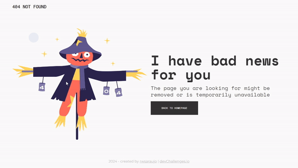

# DevChallenges - 404 Not Found

404 Not Found is a page that informs the user of the 404 ERROR (response to the request not found on the server). There is a message giving details of what happened to the user and a button to return them to the home page (not functional for the purpose of this project).

This project was developed as a challenge proposed by the devChallenges website as a way of consolidating knowledge in building responsive pages (beginner level).

## Table of contents

- [Overview](#overview)
  - [Preview](#preview)
  - [Links](#links)
- [My process](#my-process)
  - [Built with](#built-with)
- [Author](#author)

## Overview

### Preview

### Links

- Live Site URL: [Live Site](https://rwsaraujo.github.io/404-not-found/)

## My process

### Built with

- HTML
- CSS Flex Box
- JavaScript

## Author

- GitHub - [rwsaraujo](https://github.com/rwsaraujo)
